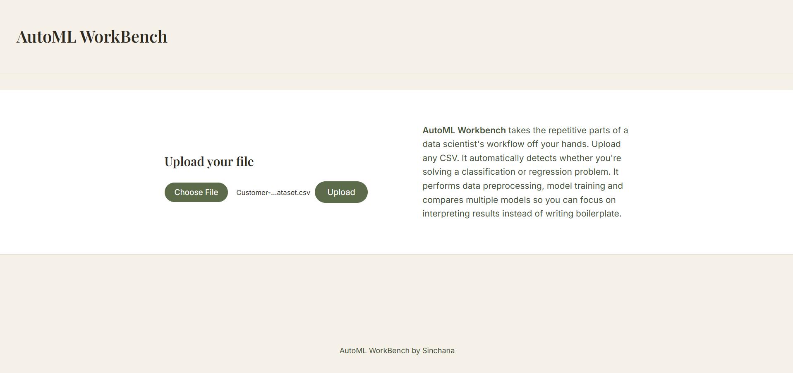
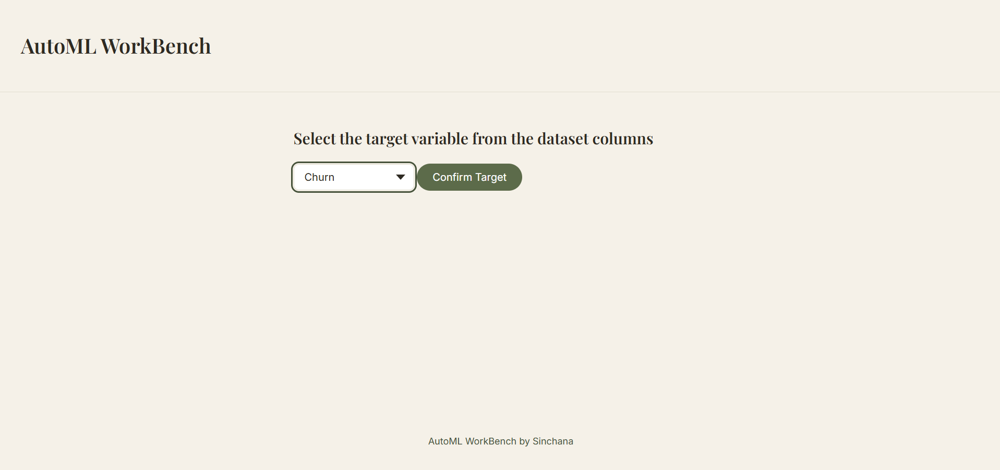
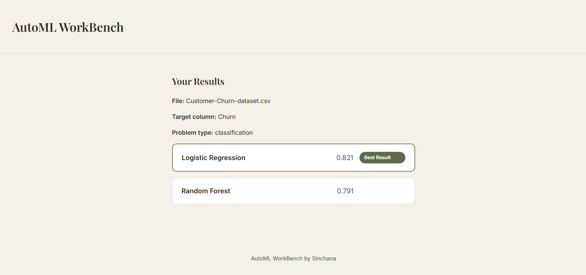

# AutoML Workbench

**Live demo:** [automl-workbench.onrender.com](https://automl-workbench.onrender.com)

Upload any CSV, pick a target column, and AutoML Workbench automatically detects whether it's a classification or regression problem, cleans the data, trains multiple models, and shows you a clear comparison of which one performed best where no manual model selection is required.

Built as a solo project to go deeper than a single "train one model on one dataset" script. The goal was a small, working version of what tools like DataRobot or Google Vertex AI do at enterprise scale: automate the repetitive parts of a data scientist's workflow (cleaning, encoding, model selection) so a person can focus on interpreting results, not writing boilerplate.

## Screenshots


**Upload page**


**Select target page**


**Results page**

## How it works

1. **Upload** a CSV file
2. **Select a target column** from an auto-generated dropdown of the dataset's columns
3. The app **automatically detects** whether this is a classification or regression problem, based on the target column's data type and number of unique values
4. **Preprocessing** runs automatically:
   - Columns with more than 80% missing values are dropped (filling them would fabricate data rather than preserve real signal)
   - Remaining missing values are filled (median for numeric columns, mode for categorical columns)
   - Columns that are almost entirely unique (like ID columns) are detected and dropped, since they carry no learnable pattern
   - Categorical columns are one-hot encoded
   - Numeric columns are scaled with `StandardScaler`
5. **Two models are trained and compared**, chosen automatically based on the detected problem type:
   - Classification → Logistic Regression + Random Forest Classifier
   - Regression → Linear Regression + Random Forest Regressor
6. **Results are logged** to a SQLite database (one row per model per run) and displayed on a styled, accessible results page, with the best-performing model clearly labeled

## Tech stack

- **Backend:** Flask (Python)
- **Data processing:** Pandas
- **Machine learning:** Scikit-learn
- **Database:** SQLite
- **Frontend:** HTML, Jinja2 templating, CSS 
- **Deployment:** Render

## Project structure

```
automl-workbench/
├── app.py              # Flask routes and app setup
├── preprocessing.py    # Data cleaning, encoding, scaling, problem-type detection
├── training.py         # Model training and comparison logic
├── database.py         # SQLite table creation and run logging
├── templates/          # Jinja HTML templates (base template + page-specific)
├── static/             # Page-specific CSS files
├── requirements.txt
└── Procfile             # Gunicorn start command for deployment
```

The app is deliberately split into single-responsibility files. `app.py` only handles routing, while data logic and model logic live in their own modules with plain function signatures (e.g. `preprocess_data(df, target_column)`). This was a conscious choice to make a future migration from Flask to Django easier: the Flask-specific code is a thin wrapper around logic that doesn't know or care which web framework is calling it.

## Running it locally

```bash
git clone https://github.com/sinchanabm-ux/automl-workbench.git
cd automl-workbench
python -m venv .venv
.venv\Scripts\Activate.ps1      # Windows PowerShell
pip install -r requirements.txt
python app.py
```

Then visit `http://127.0.0.1:5000` in your browser.

## Known limitations

- **Run history doesn't persist on the live demo.** Render's free tier uses an ephemeral filesystem, so the SQLite database resets whenever the app restarts or spins down from inactivity. Locally, run history persists normally. Migrating to a hosted database (e.g. PostgreSQL) is on the roadmap to fix this properly.
- **Model choices are fixed**, not user-selectable i.e. the app always trains the same two models per problem type. See roadmap below.

## Roadmap for Enhancements

- [ ] Standalone "clean my dataset" mode : download the cleaned CSV without training a model, with a before/after summary report of what was changed
- [ ] Let users choose preprocessing strategies (e.g. median vs. drop-rows for missing values, one-hot vs. label encoding)
- [ ] Migrate from Flask to Django
- [ ] Move from SQLite to a persistent hosted database (e.g. PostgreSQL) for reliable run history in production
- [ ] Add more models per problem type (XGBoost, gradient boosting) with async training for larger datasets
- [ ] Add basic model explainability (e.g. SHAP) so results include *why* a model performed the way it did, not just a score

## Author

Built by **Sinchana B M**